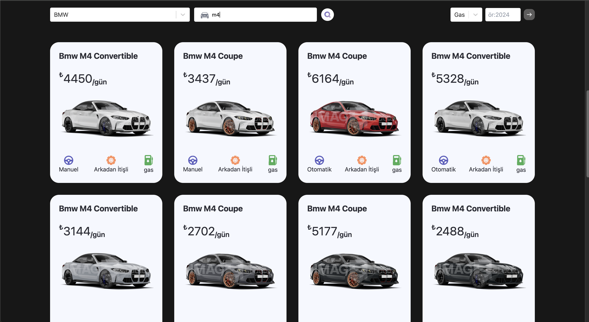
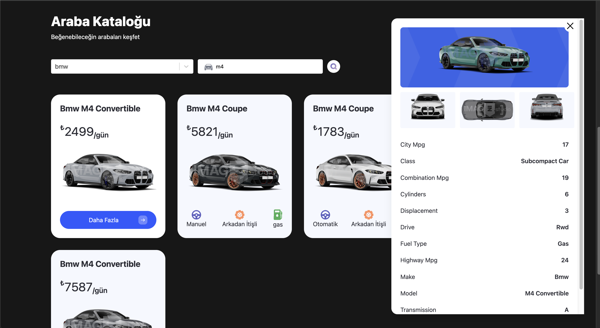

# Car Rental Application

This is a Car Rental Application developed using React and TypeScript. The application allows users to filter and list cars, and easily access detailed information about each vehicle through modal windows. It offers a fully user-friendly and responsive design, ensuring a seamless experience across all devices.

## Video gif ##


## Main Page ##


## cars List View ##


## cars Detail ##



### Table of Contents

- Features
- Technologies Used
- Installation
- Contributing
- Contact

## Features

- User-Friendly Interface: Intuitive and easy-to-navigate design.
- Responsive Design: Optimized for both mobile and desktop devices.
- Car Listing: Displays cars in a list format based on user-applied filters.
-Filtering and Search:
  - Car Name
  - Model
  - Fuel Type
  - Year
- Animated Card Structures: Visually appealing animated cards for car listings.
- Modal for Car Details: Users can access detailed information about listed cars through animated modal windows.
- State Management: Efficient state management using useState.
- API Integration: Fetches car data using the native fetch API.
- Advanced Select Components: User-friendly and customizable selection menus implemented with react-select.
- Routing: Easy navigation between pages using react-router-dom.

## Technologies Used

- React - Frontend library.
- TypeScript - For static type checking and enhancing code quality.
- Tailwind CSS - For styling and responsive design.
- Framer Motion - For animations and modal transitions.
- Fetch API - For handling API requests.
- React Router Dom - For client-side routing.
- React Select - For advanced and customizable selection components.


## Installation

- Clone the project to your local machine:
  git clone https://github.com/ozerbaykal/car-rental.git

- Navigate to the project directory:

```
cd car-rental
```

- Install the necessary packages:

```
npm install
```

### or

```
yarn install
```

## Usage

- Start the development server:

```
npm run dev
```

### or

```
yarn dev
```

<h2>Contributing</h2>

Contributions are welcome! Please open an issue first to discuss what you would like to change.

- 1.Fork the project
- 2.Create your feature branch (git checkout -b feature/NewFeature)
- 3.Commit your changes (git commit -m 'Add new feature')
- 4.Push to the branch (git push origin feature/NewFeature)
- 5.Open a Pull Request

<h2>Contact</h2>

Özer BAYKAL mail : baykalozer87@gmail.com

Project Link: https://github.com/ozerbaykal/car-rental